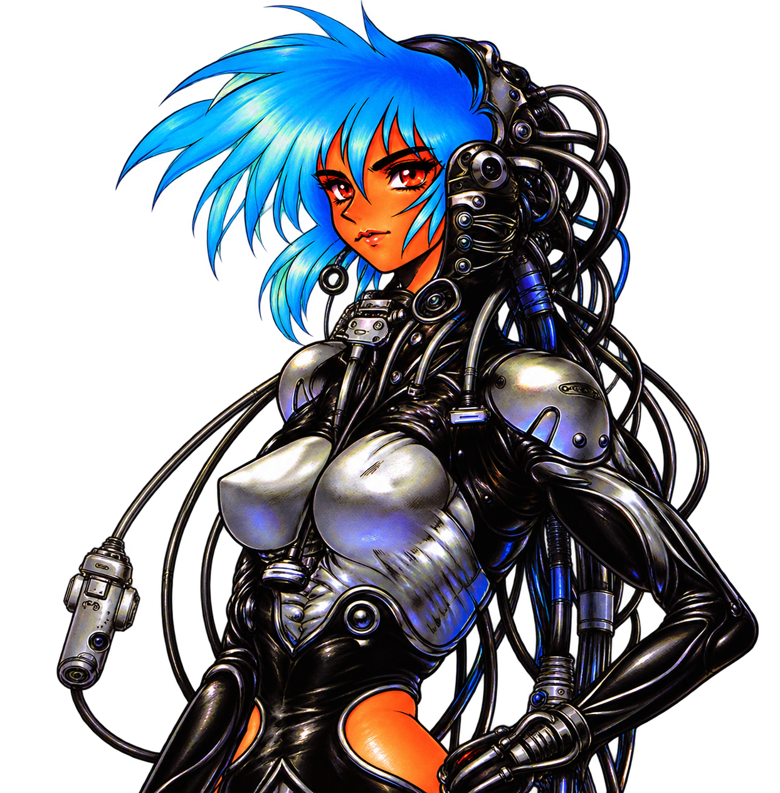

  

  
  
  

<h2 align="center">✦ I'm Astro chan ✦</h2>

  <em>just a little kawaii anime girl (guy in real life...)</em>

I mostly do small to mid-size projects with the currently sensible tech stack.

I'm a big advocate of defaulting to **Go + React** or **Go + templ + HTMX** for most projects.

I'm really curious about **Elm** and currently experimenting with it.

<h2 align="center">🌙 Current project</h2>

<h3 align="center"><a href="https://github.com/astra-chanUwU/kura-v3-elm-go">Kura V3</a></h3>

Kura is the imageboard and media-library project I'm using to try Elm with a Go backend. It has search, collections, tags, favorites, and a Lightroom-style media workspace.

<h2 align="center">🛠️ Tech stack and tools</h2>

  &nbsp;
  &nbsp;
  &nbsp;
  &nbsp;
  &nbsp;
  
   
  &nbsp;
  &nbsp;
  &nbsp;
  &nbsp;
  &nbsp;
  
   
  &nbsp;
  &nbsp;
  &nbsp;
  &nbsp;
  &nbsp;
  
   
  &nbsp;
  &nbsp;
  &nbsp;
  &nbsp;
  

<h2 align="center">💌 Links</h2>

  

<blockquote align="center">
  “What if a cyber brain could possibly generate its own ghost, create a soul all by itself?” 
  — Major Motoko Kusanagi, <em>The Ghost in the Shell</em> by Masamune Shirow
</blockquote>

  <a href="https://github.com/astra-chanUwU">GitHub</a> ·
  <a href="https://x.com/Akhu176">X / @Akhu176</a> ·
  <a href="https://efchat.net/AstroSphere">efchat / AstroSphere</a>

<h2 align="center">⌁ contribution signal ⌁</h2>

  

<strong>✨ Astro chan ✨</strong> 
<em>Fullstack · TypeScript · Go · Kawaii and Lewd</em>

  

