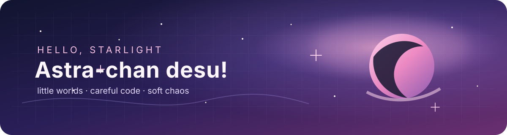

<p align="center">
  
</p>

<p align="center">
  <a href="https://github.com/astra-chanUwU"></a>
  <a href="https://github.com/astra-chanUwU?tab=repositories"></a>
  
</p>

<h2 align="center">✦ hi, i'm Astra ✦</h2>

<p align="center">
  <em>definitely not an anime girl · probably making another archive</em>
</p>

> I like building software that feels like a place you can return to: calm interfaces, durable data, and just enough magic around the edges.

I’m Astra, a software tinkerer working across **web apps, media archives, offline tools, and tiny internet worlds**. My projects tend to sit where engineering meets curation: the hard part is not only making a feature work, but making it kind to the person who has to live with it.

```text
current quest
─────────────
✦ make useful things feel a little magical
✦ turn archives into places you want to revisit
✦ leave the code kinder than i found it
```

## 🌙 things i'm building

| project | what it is | mood |
| --- | --- | --- |
| [AstroSphere](https://github.com/astra-chanUwU/astrosphere) | A static Astro archive for manga, doujinshi, image sets, and essays, with a careful local media workflow. | `archive magic` |
| [Kura V3](https://github.com/astra-chanUwU/kura-v3-elm-go) | An Elm and Go visual library with search, collections, tags, favorites, and a Lightroom-style media workspace. | `organised chaos` |
| [Report Maker](https://github.com/astra-chanUwU/report-maker-tauri-vite-react) | An offline-first desktop tool for turning vibration data into editable engineering reports. | `serious little machine` |
| [Astrochan Blog](https://github.com/astra-chanUwU/astrochan-blog) | A minimalist Hugo blog for technical notes, experiments, and the things I learn while building. | `quiet corner` |

## 🛠️ tools i reach for

<p align="center">
  
</p>

<p align="center">
  <code>server-rendered slices</code> · <code>local-first workflows</code> · <code>accessible details</code> · <code>data that stays yours</code>
</p>

## ✨ a little dashboard

<p align="center">
  
  
</p>

<p align="center">
  
</p>

## 💌 find me in the constellation

<p align="center">
  <a href="https://github.com/astra-chanUwU">GitHub</a> ·
  <a href="https://github.com/astra-chanUwU/astrochan-blog">the blog</a> ·
  <a href="https://github.com/astra-chanUwU/astrosphere">the archive</a>
</p>

<p align="center">
  <sub>thanks for stopping by · leave a ⭐ if something here made you curious</sub>
</p>
